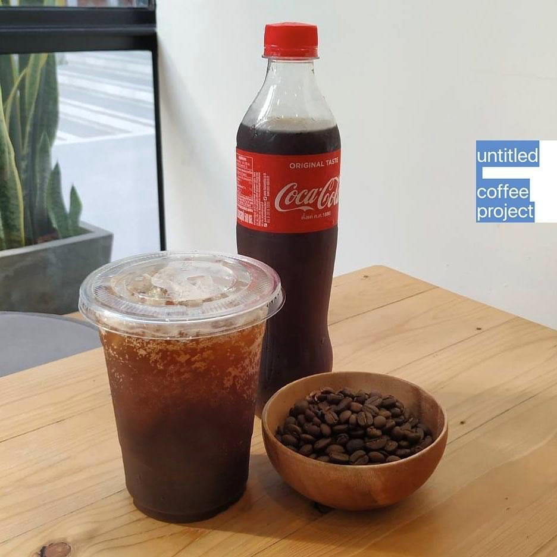
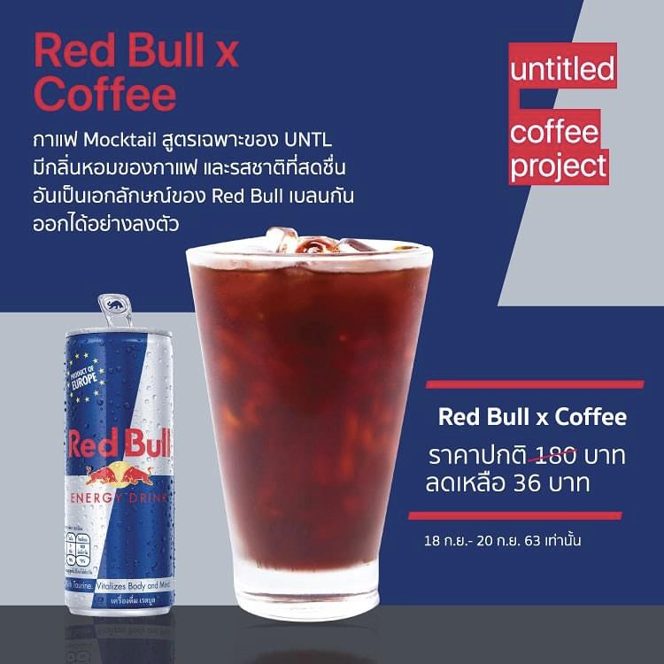
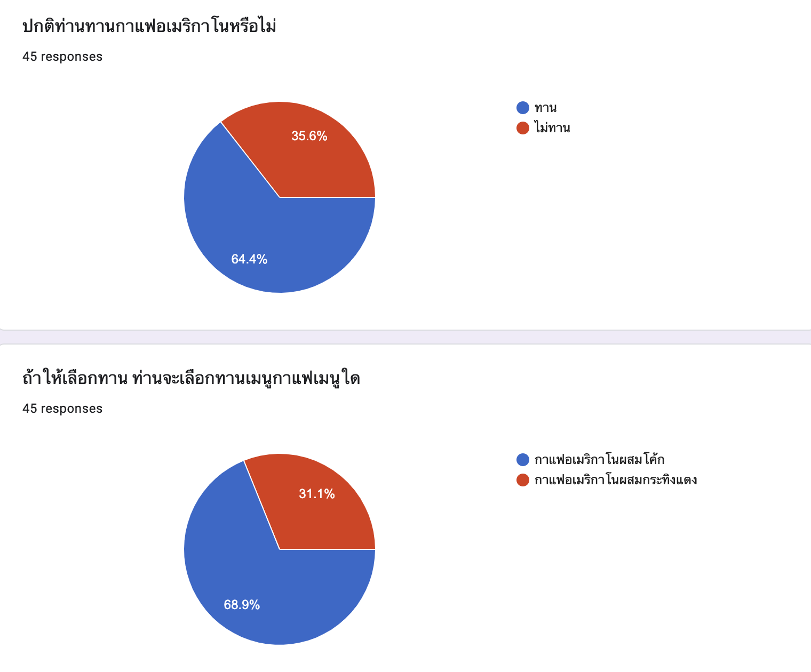

## Objective

เลือกเครื่องดื่มที่อยากรับประทาน ระหว่างกาแฟอเมริกาโนผสมโค้กและกาแฟเมริกาโน่ผสม Redbull

## Attribute

- เพศ
- อายุ
- ปกติทานกาแฟหรือไม่
- ชอบเมนูใดมากกว่ากัน (กาแฟอเมริกาโนผสมโค้กและกาแฟอเมริกาโนผสม Redbull)

## Research participant

จำนวน 45 คน

## Statistics method

Chi-square

## Summary

คนที่ปกติทานกาแฟอเมริกาโนจะเลือกกาแฟอเมริกาโนผสมโค้กมากกว่า

