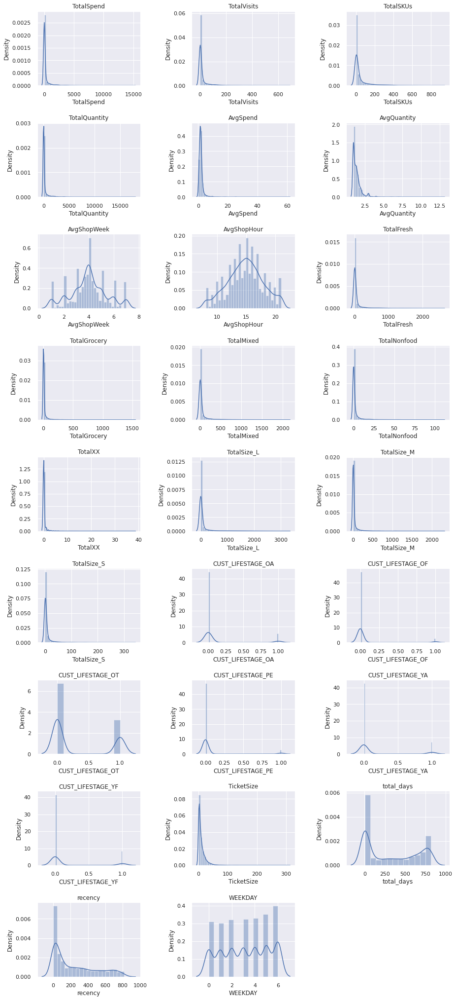

## Dataset

For dataset [click here](https://drive.google.com/file/d/1RgAKGw_u2MW2xFDUSiAwrFNPae7qj7zJ/view?usp=sharing).

## Feature

นำข้อมูลของ customer มา group ด้วย `CUST_CODE`
ซึ่ง feature ทั้งหมดที่นำมาใช้ได้แก่

- TicketSize การใช้จ่ายต่อครั้งของลูกค้า
- LastDate วันล่าสุดที่ลูกค้าเข้ามาใช้บริการ
- total_days จำนวนวันทั้งหมดที่ลูกค้ามาใช้บริการ
- WEEKDAY วันของสัปดาห์ล่าสุดที่เข้ามาใช้บริการ
  

## Histogram

นำข้อมูลที่ได้มาดูภาพรวมด้วย histogram

## Elbow

ใช้วิธี Elbow เพื่อหาจำนวน K ที่เหมาะสมในการแบ่งกลุ่ม cluster ซึ่งในที่นี้คือ 4 กลุ่ม

## PCA

นำข้อมูลมาพล็อตด้วย PCA เพื่อ Visualization ให้เห็นภาพการแบ่งกลุ่มออกเป็นจำนวน 4 กลุ่ม

## Interpret results and plan for actions

นำข้อมูลที่ได้มาทำการแบ่งกลุ่มและวางแผนในการส่งเสริมการขายแก่ลูกค้าที่แบ่งกลุ่มอย่างเหมาะสม

