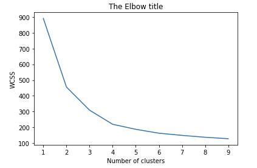
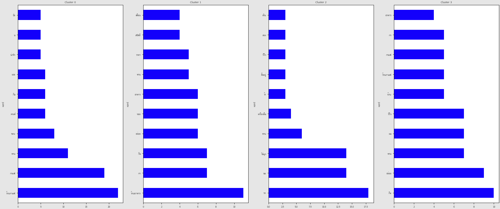

## Dataset

For dataset [click here](https://drive.google.com/file/d/1RgAKGw_u2MW2xFDUSiAwrFNPae7qj7zJ/view?usp=sharing).

## Elbow

ใช้วิธี Elbow เพื่อหาจำนวน K ที่เหมาะสมในการแบ่งกลุ่ม cluster ซึ่งในที่นี้คือ 4 กลุ่ม

## Data Cleansing

Clean data ด้วยการตัด special character, emoticon, symbol, white space รวมถึงข้อความที่ไม่เกี่ยวข้องออกจากข้อมูล

## Conclusion

**cluster0** = "ร้านคาเฟ่ ขายกาแฟ ขนม ให้คนมานั่งทำงาน"  
**cluster1** = "ร้านอาหารสำหรับครอบครัว เพื่อน"  
**cluster2** = "ร้านเครื่องดื่ม ประเภท ชานมไข่มุก ชา นม"  
**cluster3** = "ร้านอาหาร รวมทั้งขาย เครื่องดื่ม กาแฟ เป็นร้านที่ดัง ได้รับรีวิวเยอะ"
